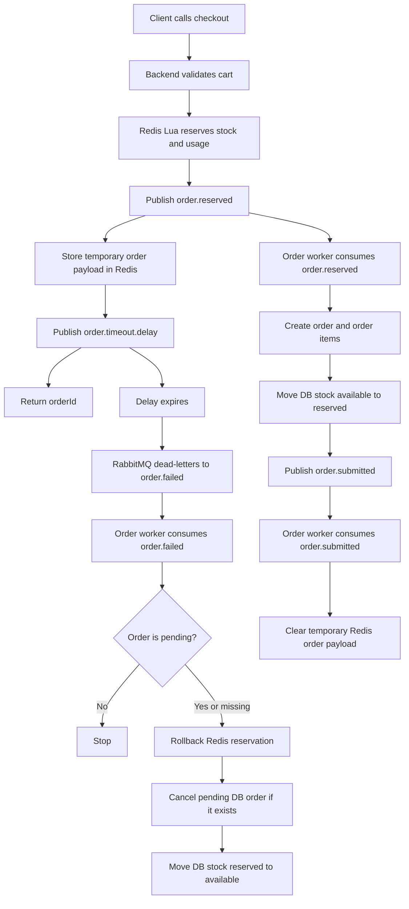

# Order Flow

This document describes the current checkout and asynchronous order-processing flow.

## Checkout API

The checkout endpoint validates the authenticated user's cart and performs the first, fast reservation in Redis.

1. Validate the cart and active promo rules.
2. Generate an `orderId`.
3. Reserve product stock, user product usage, and promo usage in Redis with an atomic Lua script.
4. Publish `order.reserved`.
5. Store the temporary order payload in Redis at `order:{orderId}`.
6. Publish `order.timeout.delay`.
7. Return the `orderId` to the client.

If checkout fails before `order.reserved` is published, the API rolls back the Redis reservation directly.

If checkout fails after `order.reserved` is published, the API publishes `order.failed` so the order worker can run the same compensation path used by timeout/failure handling.

## Queues

- `order.reserved` - Created by checkout after Redis reservation succeeds.
- `order.submitted` - Created by the order worker after an order is created from `order.reserved`.
- `order.failed` - Compensation queue used for reservation failure, timeout, or checkout recovery.
- `order.timeout.delay` - Delay queue with `x-message-ttl`; expired messages dead-letter to `order.failed`.

## `order.reserved`

The order worker consumes `order.reserved` and creates the database representation of the reserved checkout.

1. Insert the order.
2. Insert order items.
3. Move stock counters in the database from available to reserved.
4. Publish `order.submitted`.

If the order already exists, the message is treated as a duplicate and stock is not mutated again.

If processing fails for a valid `order.reserved` payload, the consumer publishes `order.failed` with the original order id, user id, and items so Redis reservations can be restored.

## `order.submitted`

The order worker consumes `order.submitted` after the order has been created.

Current behavior:

1. Load the order and order items.
2. If the order is already submitted, clear the temporary Redis order key and stop.
3. If the order is not pending, stop.
4. Clear the temporary Redis order key.

This handler is intentionally idempotent so duplicate `order.submitted` messages do not submit or clear stock twice.

## `order.timeout.delay`

Checkout publishes `order.timeout.delay` after `order.reserved`.

The queue is declared with:

- `x-message-ttl: orderTimeoutTtlMs`
- `x-dead-letter-exchange: ''`
- `x-dead-letter-routing-key: order.failed`

When the timeout expires, RabbitMQ moves the message to `order.failed`.

## `order.failed`

The order worker consumes `order.failed` as the central compensation flow.

1. Load the order if it exists.
2. If the order exists and is not pending, stop. This prevents late timeout messages from rolling back submitted or cancelled orders.
3. Resolve the order items and user id from the message or database order.
4. Roll back Redis reservations with the shared Lua rollback script.
5. If a pending database order exists:
   - mark it cancelled
   - move database stock counters from reserved back to available
   - create a reserve-cancel stock transaction

If the order does not exist, the worker only restores the Redis reservation.

## Flow Diagram

